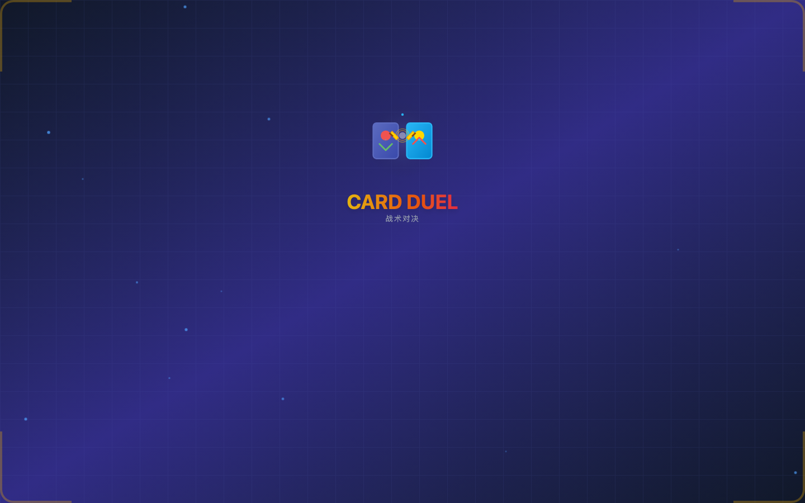
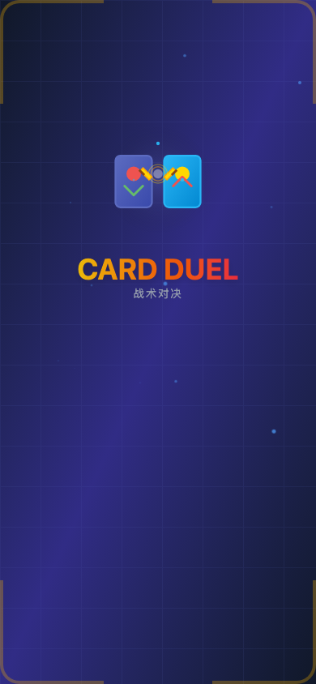

# Card Duel / 卡牌对决

Card Duel is a web-first card battle game UI project with desktop (Electron) and mobile (Capacitor) build pipelines.  
卡牌对决是一个以 Web 为核心的卡牌战斗 UI 项目，支持桌面端（Electron）与移动端（Capacitor）构建流程。

Original Figma source / 原始 Figma 设计稿:  
https://www.figma.com/design/bZf9InWwFuNleH1FD0jtBc/Card-Battle-Game-UI-Design

## Screenshots / 界面截图

### Desktop Start Screen / 桌面端开始界面


### Mobile Start Screen / 移动端开始界面


## Features / 功能亮点

- Responsive battle layout for desktop and mobile  
  桌面与移动端自适应战斗布局
- Turn indicator animation, attack lines, damage popups, and particle effects  
  回合提示动画、攻击连线、伤害数字和粒子特效
- Mobile UI improvements: safe-area support, stable action bar sizing, and layered hand zone  
  移动端优化：安全区适配、底部按钮尺寸稳定、手牌区分层
- Desktop packaging via Electron Builder and mobile shell builds via Capacitor  
  通过 Electron Builder 打包桌面端，通过 Capacitor 构建移动端壳

## Tech Stack / 技术栈

- React + TypeScript + Vite
- Tailwind CSS + Motion (`motion/react`)
- React DnD (`react-dnd`, `react-dnd-html5-backend`)
- Electron + electron-builder
- Capacitor (`@capacitor/core/android/ios`)
- Vitest

## Quick Start / 快速开始

### 1) Install / 安装依赖

```bash
npm install
```

### 2) Web development / Web 本地开发

```bash
npm run dev
```

### 3) Run tests / 运行测试

```bash
npm run test
```

### 4) Production web build / 构建 Web 产物

```bash
npm run build
```

## Desktop Build (Electron) / 桌面端构建

```bash
npm run desktop:dev
npm run desktop:build
npm run desktop:dist
```

- `desktop:dev`: run Vite + Electron in development mode  
  `desktop:dev`：开发模式运行 Vite + Electron
- `desktop:build`: build unpacked app (`electron-builder --dir`)  
  `desktop:build`：构建未打包目录版本（`electron-builder --dir`）
- `desktop:dist`: build distributable packages/installers  
  `desktop:dist`：生成可分发安装包

## Mobile Build (Capacitor) / 移动端构建

```bash
npm run mobile:sync
npm run mobile:build:android
npm run mobile:build:ios
```

- Android target: debug APK output  
  Android 目标：输出 debug APK
- iOS target: simulator app build (no code signing)  
  iOS 目标：模拟器构建（无签名）

## CI/CD / 持续集成与发布

- CI workflow: `.github/workflows/ci.yml`  
  Triggers on `push`/`pull_request` to `main`, runs `npm ci`, `npm run test`, `npm run build`.  
  CI 工作流：`.github/workflows/ci.yml`  
  在 `main` 分支的 `push`/`pull_request` 触发，执行 `npm ci`、`npm run test`、`npm run build`。

- Release workflow: `.github/workflows/release.yml`  
  Triggers on tags matching `v*` (for example `v1.0.5`).  
  Builds desktop artifacts (macOS/Windows/Linux) and mobile artifacts (Android/iOS) and uploads them to GitHub Release.  
  发布工作流：`.github/workflows/release.yml`  
  在 `v*` 标签（例如 `v1.0.5`）触发，构建桌面端与移动端产物并上传到 GitHub Release。

## Project Structure / 目录结构

```text
src/
  app/
    components/      # UI components
    hooks/           # state and platform hooks
    systems/         # effects, audio, ranking, achievements...
    logic/           # pure battle logic
    data/            # card database
    resources/       # image/audio manifests
.github/workflows/  # CI/CD pipelines
electron/           # Electron main/preload
build/icons/        # app icons
docs/screenshots/   # README screenshots
```

## Assets / 图标资源

Icons are in `build/icons/`:

- `icon.png` (base)
- `icon.ico` (Windows)
- `icon.icns` (macOS)
  
